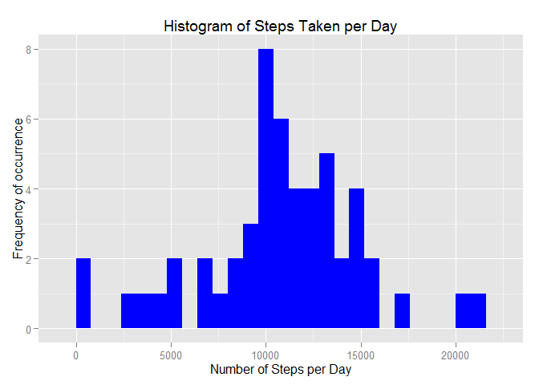
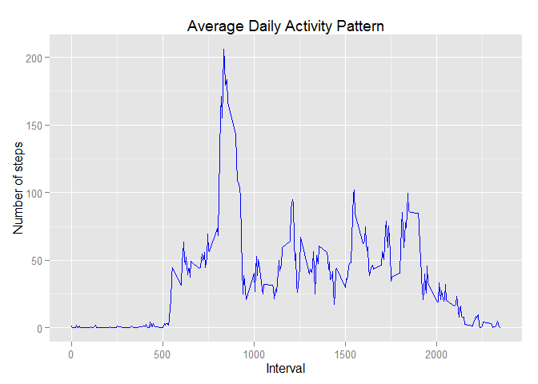
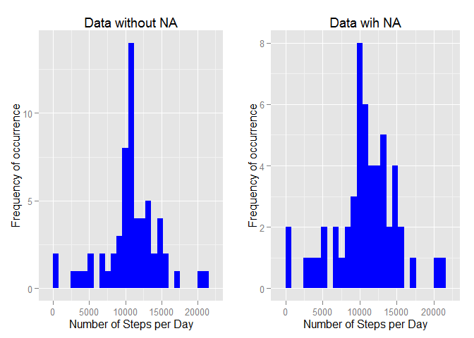
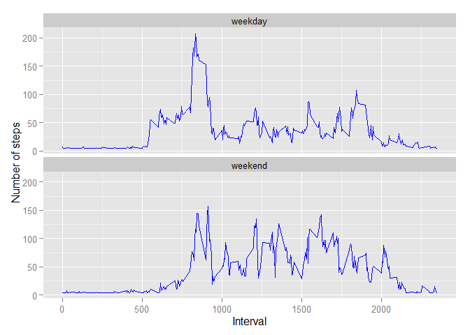

Reproducible Research Peer Assessment 1
========================
### *Hristo Hristov*
#### *17 May 2015*

## Preperation

Loading packages and setting the defaults for the ecko and result:

```r
library(ggplot2)
```

```
## Warning: package 'ggplot2' was built under R version 3.1.3
```

```r
library(gridExtra)
```

```
## Warning: package 'gridExtra' was built under R version 3.1.3
```

```
## Loading required package: grid
```

```r
library(knitr)
```

```
## Warning: package 'knitr' was built under R version 3.1.3
```

```r
opts_chunk$set(echo = TRUE, results = 'hold')
```

## Loading and preprocessing the data


```r
data<-read.csv(unzip("activity.zip"))
```

Check the classes of the variables

```r
str(data)
```

```
## 'data.frame':	17568 obs. of  3 variables:
##  $ steps   : int  NA NA NA NA NA NA NA NA NA NA ...
##  $ date    : Factor w/ 61 levels "2012-10-01","2012-10-02",..: 1 1 1 1 1 1 1 1 1 1 ...
##  $ interval: int  0 5 10 15 20 25 30 35 40 45 ...
```

format the "date"" variable as class Date and "intervals" as factor

```r
data$date <- as.Date(data$date, format = "%Y-%m-%d")
data$interval <- as.factor(data$interval)
```

Check again

```r
str(data)
```

```
## 'data.frame':	17568 obs. of  3 variables:
##  $ steps   : int  NA NA NA NA NA NA NA NA NA NA ...
##  $ date    : Date, format: "2012-10-01" "2012-10-01" ...
##  $ interval: Factor w/ 288 levels "0","5","10","15",..: 1 2 3 4 5 6 7 8 9 10 ...
```

## What is mean total number of steps taken per day?

Calculating steps per day:

```r
steps_per_day <- aggregate(steps ~ date, data, sum, na.rm=T)
colnames(steps_per_day) <- c("date","steps")
head(steps_per_day)
```

```
##         date steps
## 1 2012-10-02   126
## 2 2012-10-03 11352
## 3 2012-10-04 12116
## 4 2012-10-05 13294
## 5 2012-10-06 15420
## 6 2012-10-07 11015
```
Day 1 is not present here because the NA values have been ignored (as well as other days with only NA values)

#### 1. Histogram

```r
ggplot(steps_per_day, aes(x = steps)) + 
    geom_histogram(fill = "blue", binwidth = 800) + 
    labs(title="Histogram of Steps Taken per Day", 
         x = "Number of Steps per Day", y = "Frequency of occurrence")
```

 

#### 2. Calculating the mean and median

```r
mean   <- mean(steps_per_day$steps, na.rm=TRUE)
median <- median(steps_per_day$steps, na.rm=TRUE)
```
That gives us mean of 10766.19 and median of 10765

## What is the average daily activity pattern?

#### 1. First - calculating the average steps per interval for all the intervals in a day
(also give the columns new names and format the intervals as integers)

```r
steps_per_interval <- aggregate(data$steps,by = list(interval = data$interval),FUN=mean, na.rm=TRUE)
colnames(steps_per_interval) <- c("interval", "steps")
steps_per_interval$interval <- as.integer(levels(steps_per_interval$interval))
```


#### 2. Then - create the time series plot

```r
ggplot(steps_per_interval, aes(x=interval, y=steps)) +   
    geom_line(color="blue") +  
    labs(title="Average Daily Activity Pattern", x="Interval", y="Number of steps")
```

 


#### 3. Finaly we search for the interval which containes on average the most steps

```r
steps_per_interval[which.max(steps_per_interval$steps),]
```

```
##     interval    steps
## 104      835 206.1698
```
As observed above, the 835th interval has the highest number of steps - 206 (also evident from the plot above)

## Imputing missing values

#### 1. How many missing values in the data set

```r
summary(data)
```

```
##      steps             date               interval    
##  Min.   :  0.00   Min.   :2012-10-01   0      :   61  
##  1st Qu.:  0.00   1st Qu.:2012-10-16   5      :   61  
##  Median :  0.00   Median :2012-10-31   10     :   61  
##  Mean   : 37.38   Mean   :2012-10-31   15     :   61  
##  3rd Qu.: 12.00   3rd Qu.:2012-11-15   20     :   61  
##  Max.   :806.00   Max.   :2012-11-30   25     :   61  
##  NA's   :2304                          (Other):17202
```
or

```r
sum(is.na(data))
```

```
## [1] 2304
```
but from the first method it is noticable that missinga values are only observed within the steps variable and their number is 2304.

#### 2. Replace missing values and create new data set without NA
From the summay data above we can use the mean value for the steps per interval, namely the value that we will obtain if we divide the daily mean by the number of intervals each day, which is 288

```r
rep_value<-mean/288
rep_value
```

```
## [1] 37.3826
```

We can now duplicate the data set and fill in the missing values

```r
data2<-data
data2[is.na(data2)]<-rep_value
head(data2)
sum(is.na(data2))
```

```
##     steps       date interval
## 1 37.3826 2012-10-01        0
## 2 37.3826 2012-10-01        5
## 3 37.3826 2012-10-01       10
## 4 37.3826 2012-10-01       15
## 5 37.3826 2012-10-01       20
## 6 37.3826 2012-10-01       25
## [1] 0
```

#### 3. Calculating the new mean, median, and ploting the new histogram

```r
steps_per_day2 <- aggregate(steps ~ date, data2, sum, na.rm=T)
colnames(steps_per_day2) <- c("date","steps")
mean2 <- mean(steps_per_day2$steps, na.rm=TRUE)
median2 <- median(steps_per_day2$steps, na.rm=TRUE)
```

That gives us mean of 10766.19 and median of 10766.19 compared to the old result for mean  10766.19 and median 10765

**Histogram**

```r
h1<-ggplot(steps_per_day2, aes(x = steps)) + 
    geom_histogram(fill = "blue", binwidth = 800) + 
    labs(title="Data without NA", 
         x = "Number of Steps per Day", y = "Frequency of occurrence")
h2<-ggplot(steps_per_day, aes(x = steps)) + 
    geom_histogram(fill = "blue", binwidth = 800) + 
    labs(title="Data wih NA", 
         x = "Number of Steps per Day", y = "Frequency of occurrence")
grid.arrange(h1,h2,nrow=1)
```

 

The mean is still the same and that is to be expected since we replaced the missing values with the mean, so there is no effect there. The median has slightly increased, but not dramatically. However, from th histograms we can see that the peak has sharpened and the mode interval has shifted slightly to the right, but the general shape has staid the same.

## Are there differences in activity patterns between weekdays and weekends?
We do this comparison with the table with filled-in missing values.
1. Augment the table with a column that indicates the day of the week
2. Subset the table into two parts - weekends (Saturday and Sunday) and weekdays (Monday through Friday).
3. Tabulate the average steps per interval for each data set.
4. Plot the two data sets side by side for comparison.

```r
weekdays_steps <- function(dat) {
    weekdays_steps <- aggregate(dat$steps, by=list(interval = dat$interval),
                          FUN=mean, na.rm=T)
    # convert to integers for plotting
    weekdays_steps$interval <- 
            as.integer(levels(weekdays_steps$interval)[weekdays_steps$interval])
    colnames(weekdays_steps) <- c("interval", "steps")
    weekdays_steps
}

data_by_weekdays <- function(dat) {
    dat$weekday <- 
            as.factor(weekdays(dat$date)) # weekdays
    weekend_data <- subset(dat, weekday %in% c("Saturday","Sunday"))
    weekday_data <- subset(dat, !weekday %in% c("Saturday","Sunday"))

    weekend_steps <- weekdays_steps(weekend_data)
    weekday_steps <- weekdays_steps(weekday_data)

    weekend_steps$dayofweek <- rep("weekend", nrow(weekend_steps))
    weekday_steps$dayofweek <- rep("weekday", nrow(weekday_steps))

    data_by_weekdays <- rbind(weekend_steps, weekday_steps)
    data_by_weekdays$dayofweek <- as.factor(data_by_weekdays$dayofweek)
    data_by_weekdays
}

data_weekdays <- data_by_weekdays(data2)
```
#### Comparison Plot

```r
ggplot(data_weekdays, aes(x=interval, y=steps)) + 
        geom_line(color="blue") + 
        facet_wrap(~ dayofweek, nrow=2, ncol=1) +
        labs(x="Interval", y="Number of steps")
```

 

From the two plots above we can see that during weekdays there is much higher peak but the steps seldom go above 100, whereas during weekends there is no such peak (or at least far lower), but the average number of steps is higher across the different intervals.
